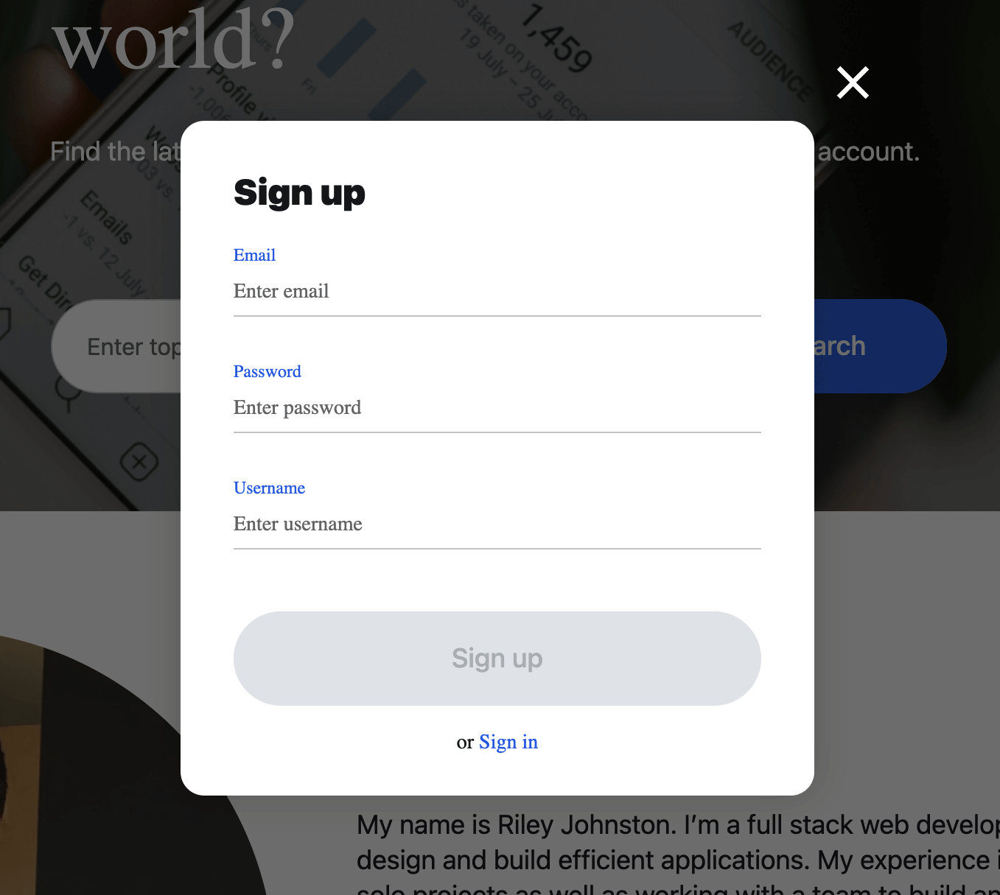
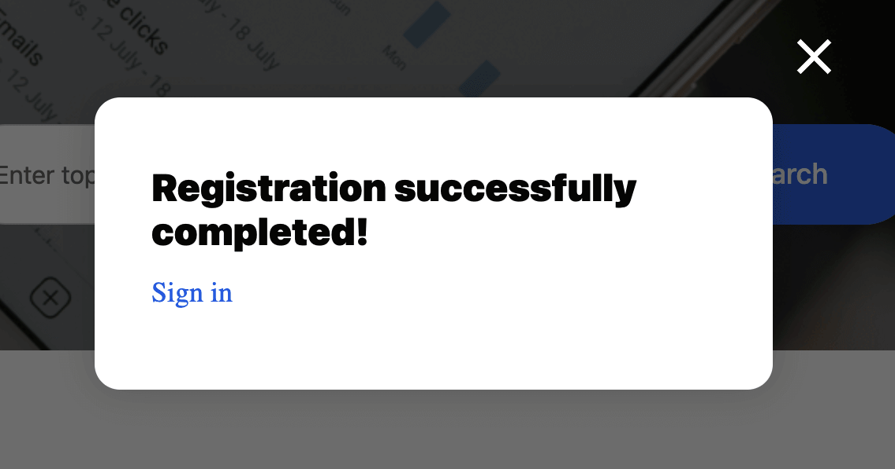
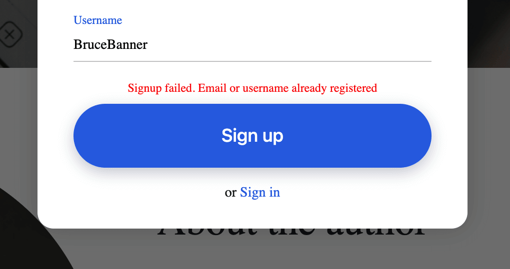
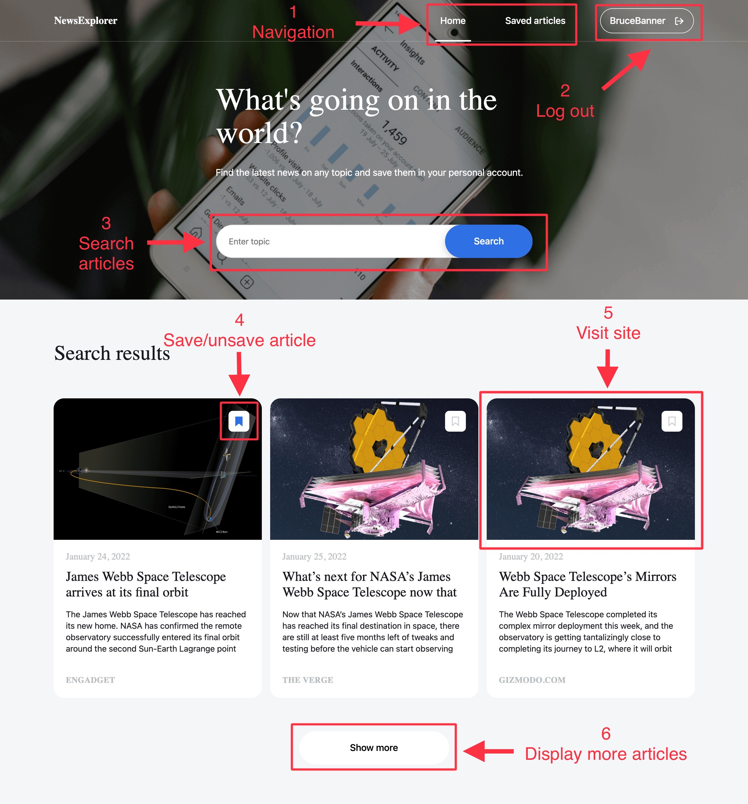
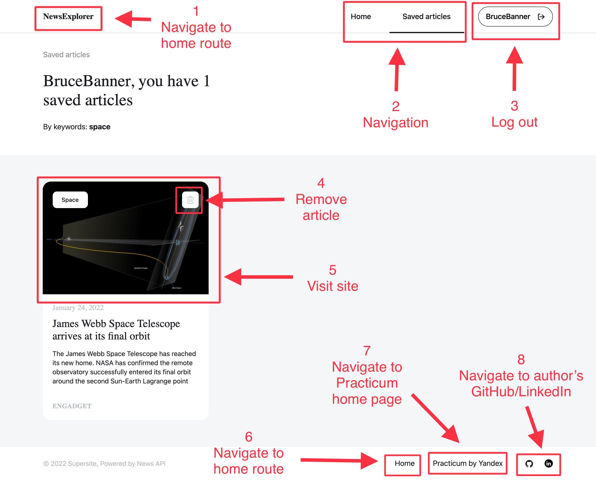

# News Explorer
*News Explorer* is allows users to search for news, create an account and save articles. [You can watch the demo here!](https://www.loom.com/share/15c90be6c7cc4f018fda792be4a1f7b0?sharedAppSource=personal_library)
  
[my-news-explorer.students.nomoreparties.sbs](https://my-news-explorer.students.nomoreparties.sbs) 
[www.my-news-explorer.students.nomoreparties.sbs](https://www.my-news-explorer.students.nomoreparties.sbs)

---

## Application Features
* responsive design
* search for news (must be signed in to save articles)
* create an account / sign in

  
* a success popup appears if everything goes well

  
* an error message will appear over the sign up / sign in buttons if something goes wrong

  
### Overview of the home route functionality
1. Navigate between pages on the app
2. Log out of the app
3. Search for articles
4. Save or unsave articles. The blue bookmark is a saved article. The unfilled bookmark is not saved.
5. Visit the article site by clicking on the image
6. Display more articles by clicking show more. Three additional articles will be displayed per click. The show more button will disappear when there are no more articles.

  
### Overview of the saved-articles route functionality
1. Clicking the NewsExplorer icon navigates to the home route
2. Navigate between pages on the app
3. Log out of the app
4. Remove the article from saved
5. Visit the article site by clicking on the image
6. Navigate to the home route
7. Navigate to the Practicum home page
8. Navigate to the site creator's Github and Linkedin profile pages

---
## Technologies and Libraries
MongoDB - Express.js - React - Node.js

Frontend
* [News API](https://newsapi.org/) for retrieving articles
* functional components, hooks (state, context, effects), navigation
* styled-components: makes everything look sharp and behave responsively
* JSON web tokens: simplifies the authentication process

Backend
* JSON web tokens: simplifies the authentication process
* celebrate: inbound data validation
* mongoose: allows JavaScript to work with our database (MongoDB)
* bcryptjs: protects passwords with hashes and a 10 character salt
* middlewares: express request limiter, request and error logging with winston/express-winston, enabling CORS, authorization, HTTP headers with helmet

---

## Deployment
*News Explorer* is deployed with Google Cloud. It features HTTPS protocol via SSL certificates and redirects requests using NGINX. The app can be viewed at:  
[my-news-explorer.students.nomoreparties.sbs](https://my-news-explorer.students.nomoreparties.sbs) 
[www.my-news-explorer.students.nomoreparties.sbs](https://www.my-news-explorer.students.nomoreparties.sbs)

---

## Getting started - development
1. copy the repositories to your machine (links to repository below)
2. run 'npm i' in the root directory of each project
3. run 'npm run dev' from to launch the backend. [New Explorer backend respository](https://github.com/rileydanejohnston/news-explorer-backend)
4. run 'npm run start' from to launch the frontend. [News Explorer frontend repository](https://github.com/rileydanejohnston/news-explorer-frontend)
5. that's it. have fun!!
